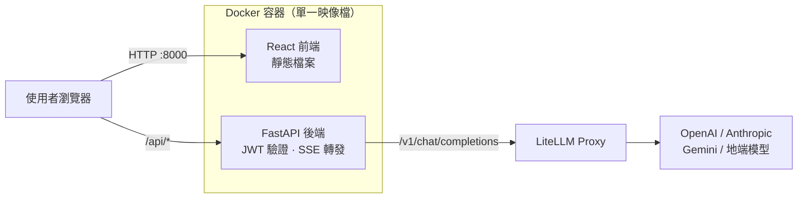

# LiteLLM Chatbot UI

一套可直接部署的 **對話式 AI 網頁介面**，前端提供登入驗證與即時串流對話，後端以 FastAPI 轉發請求到你自己的 [LiteLLM Proxy](https://github.com/BerriAI/litellm)，讓 OpenAI、Anthropic、Gemini、地端模型等各家供應商，都能透過同一個介面使用。

整個服務打包成 **單一 Docker 映像檔**，用 `make up` 一行指令即可啟動。

<p align="center">
  
  
  
  
  
  
</p>

---

## 功能特色

| 功能 | 說明 |
| --- | --- |
| 🔐 登入驗證 | 帳號密碼由環境變數設定，登入後取得 JWT，所有 API 皆需憑證才能呼叫 |
| ⚡ 串流回覆 | 透過 SSE 逐字顯示模型回覆，並可隨時按下停止 |
| 🔀 模型切換 | 自動讀取 LiteLLM 上的可用模型，支援搜尋與白名單限制 |
| 💬 多對話管理 | 可同時保留多組對話、自動命名、隨時刪除，紀錄存在瀏覽器本機 |
| 📝 Markdown 渲染 | 支援表格、清單、程式碼語法高亮，程式碼區塊可一鍵複製 |
| ⚙️ 對話參數 | 可自訂系統提示詞（System Prompt）、Temperature 與回覆長度上限 |
| 🌗 深淺色主題 | 自動跟隨系統設定，也可手動切換並記住偏好 |
| 📱 響應式設計 | 桌機、平板、手機皆有對應版面 |
| 🐳 單一容器 | 前端建置產物由後端一併提供，只需開放一個埠號 |

---

## 系統架構



請求流程：

1. 使用者在登入頁輸入帳密 → 後端比對 `AUTH_USERS` → 回傳 JWT。
2. 前端帶著 JWT 呼叫 `/api/models` 取得可用模型清單。
3. 送出訊息後呼叫 `/api/chat`，後端加上 LiteLLM 的 API Key 轉發給 LiteLLM。
4. LiteLLM 的串流回應原封不動轉回前端，逐字渲染成畫面。

> LiteLLM 的 API Key 只存在後端容器內，不會出現在瀏覽器中。

---

## 快速開始

### 方式一：Docker（建議）

需求：Docker 20.10 以上、Docker Compose v2、`make`。

```bash
# 1. 取得程式碼
git clone https://github.com/LiuYuWei/litellm-chatbot-ui.git
cd litellm-chatbot-ui

# 2. 建立設定檔
make env

# 3. 編輯 .env，至少要設定這三項：
#    LITELLM_BASE_URL / LITELLM_API_KEY / DEFAULT_MODEL
vim .env

# 4. 建置並啟動
make up
```

啟動後開啟 <http://localhost:8000>，以 `.env` 中 `AUTH_USERS` 設定的帳密登入即可。

常用指令：

```bash
make logs      # 查看即時日誌
make health    # 確認服務與 LiteLLM 連線狀態
make down      # 停止服務
```

### 方式二：本機開發

需求：Python 3.11 以上、Node.js 20 以上。

```bash
make env         # 建立 .env 並填入設定
make install     # 安裝前後端相依套件
make dev         # 後端 :8000、前端 :5173 同時啟動
```

開發模式請開啟 <http://localhost:5173>，Vite 會自動把 `/api` 請求代理到後端，前端改動即時熱更新。

若想模擬正式環境（前端建置後由後端統一提供）：

```bash
make run         # 建置前端後啟動，統一由 http://localhost:8000 提供
```

---

## 環境變數說明

所有設定都集中在 `.env`（可由 `make env` 從 `.env.example` 產生）。

### LiteLLM 連線

| 變數 | 預設值 | 說明 |
| --- | --- | --- |
| `LITELLM_BASE_URL` | `http://localhost:4000` | LiteLLM Proxy 位址，**不要**加上 `/v1` |
| `LITELLM_API_KEY` | 空 | LiteLLM 的 API Key（`sk-...`），未啟用驗證可留空 |
| `LITELLM_TIMEOUT` | `120` | 呼叫 LiteLLM 的逾時秒數 |

### 模型

| 變數 | 預設值 | 說明 |
| --- | --- | --- |
| `DEFAULT_MODEL` | `gpt-4o-mini` | 預設模型，**請填 LiteLLM 上實際存在的模型名稱** |
| `ALLOWED_MODELS` | 空 | 模型白名單（逗號分隔）；留空代表採用 LiteLLM 回傳的完整清單 |

### 登入

| 變數 | 預設值 | 說明 |
| --- | --- | --- |
| `AUTH_USERS` | `admin:admin1234` | 可登入的帳密，格式 `帳號:密碼`，多組以逗號分隔 |
| `JWT_SECRET` | `please-change-...` | JWT 簽章金鑰，**正式環境務必更換**（可用 `make secret` 產生） |
| `JWT_EXPIRE_MINUTES` | `720` | 登入有效時間（分鐘），預設 12 小時 |

### 伺服器

| 變數 | 預設值 | 說明 |
| --- | --- | --- |
| `APP_PORT` | `8000` | 容器對外開放的埠號 |
| `CORS_ORIGINS` | `*` | 允許的 CORS 來源，多個以逗號分隔 |
| `LOG_LEVEL` | `info` | 日誌等級：`debug` / `info` / `warning` / `error` |

設定範例：

```bash
LITELLM_BASE_URL=https://litellm.example.com
LITELLM_API_KEY=sk-xxxxxxxxxxxxxxxx
DEFAULT_MODEL=gpt-4o-mini
ALLOWED_MODELS=gpt-4o-mini,claude-sonnet-4,gemini-2.5-pro
AUTH_USERS=alice:StrongPass123,bob:AnotherPass456
JWT_SECRET=<請用 make secret 產生>
```

---

## Makefile 指令

執行 `make help` 可隨時查看完整清單。

| 指令 | 用途 |
| --- | --- |
| `make env` | 由 `.env.example` 建立 `.env`（已存在則不覆蓋） |
| `make secret` | 產生一組隨機的 `JWT_SECRET` |
| `make install` | 安裝前後端所有相依套件 |
| `make dev` | 同時啟動前後端開發伺服器 |
| `make dev-backend` / `make dev-frontend` | 只啟動其中一邊 |
| `make typecheck` | 執行前端 TypeScript 型別檢查 |
| `make build` | 建置前端並輸出到 `backend/static` |
| `make run` | 建置前端後以單一服務啟動 |
| `make docker-build` | 只建置 Docker 映像檔 |
| `make up` / `make down` / `make restart` | 啟動 / 停止 / 重啟容器 |
| `make logs` / `make ps` / `make shell` | 日誌 / 狀態 / 進入容器 |
| `make health` | 檢查服務與 LiteLLM 連線狀態 |
| `make clean` / `make clean-all` | 清除建置產物 / 連相依套件一併清除 |

---

## API 說明

後端啟動後可於 <http://localhost:8000/docs> 查看互動式 API 文件。

| 方法 | 路徑 | 需要驗證 | 說明 |
| --- | --- | --- | --- |
| `POST` | `/api/auth/login` | 否 | 帳密登入，回傳 JWT |
| `GET` | `/api/auth/me` | 是 | 確認目前登入身分與 token 是否有效 |
| `GET` | `/api/models` | 是 | 取得可用模型清單與預設模型 |
| `POST` | `/api/chat` | 是 | 送出對話，預設以 SSE 串流回傳 |
| `GET` | `/api/health` | 否 | 健康檢查，同時回報 LiteLLM 是否可連線 |

呼叫範例：

```bash
# 登入取得 token
TOKEN=$(curl -s -X POST http://localhost:8000/api/auth/login \
  -H 'Content-Type: application/json' \
  -d '{"username":"admin","password":"admin1234"}' | jq -r .access_token)

# 串流對話
curl -N -X POST http://localhost:8000/api/chat \
  -H "Authorization: Bearer $TOKEN" \
  -H 'Content-Type: application/json' \
  -d '{"messages":[{"role":"user","content":"你好"}],"stream":true}'
```

---

## 專案結構

```
litellm-chatbot-ui/
├── backend/                    # FastAPI 後端
│   ├── app/
│   │   ├── main.py             # 應用進入點、靜態檔案與 SPA 路由
│   │   ├── config.py           # 環境變數設定
│   │   ├── auth.py             # JWT 簽發與驗證
│   │   ├── schemas.py          # 請求／回應資料結構
│   │   ├── litellm_client.py   # 與 LiteLLM 溝通的用戶端
│   │   └── routers/
│   │       ├── auth.py         # 登入相關端點
│   │       ├── chat.py         # 對話端點（SSE 串流）
│   │       └── models.py       # 模型清單端點
│   └── requirements.txt
├── frontend/                   # React + TypeScript 前端
│   └── src/
│       ├── pages/              # 登入頁、對話頁
│       ├── components/         # 側邊欄、訊息、輸入框、設定等元件
│       ├── context/            # 登入狀態管理
│       └── lib/                # API 呼叫、本機儲存、工具函式
├── Dockerfile                  # 多階段建置：Node 建前端 → Python 執行
├── docker-compose.yml
├── Makefile
└── .env.example
```

---

## 常見問題

<details>
<summary><b>登入後看不到任何模型？</b></summary>

請先執行 `make health` 確認 `litellm_reachable` 是否為 `true`。若為 `false`，請檢查：

- `LITELLM_BASE_URL` 是否正確且**沒有**多加 `/v1`
- `LITELLM_API_KEY` 是否有效
- 容器是否連得到該位址（若 LiteLLM 跑在本機，容器內請用 `http://host.docker.internal:4000`）
</details>

<details>
<summary><b>出現「key not allowed to access model」錯誤？</b></summary>

代表 `DEFAULT_MODEL` 或所選模型不在該 LiteLLM API Key 的授權範圍內。請把 `DEFAULT_MODEL` 改成 LiteLLM 上實際可用的模型名稱，可先用 `/api/models` 或 LiteLLM 的 `/v1/models` 確認。
</details>

<details>
<summary><b>對話紀錄存在哪裡？</b></summary>

存在使用者瀏覽器的 `localStorage`，不會寫入伺服器。因此換瀏覽器或清除瀏覽資料後紀錄就會消失，伺服器端也不會留存任何對話內容。
</details>

<details>
<summary><b>可以放到公開網路上嗎？</b></summary>

可以，但請務必先做到：

1. 用 `make secret` 產生新的 `JWT_SECRET`
2. `AUTH_USERS` 改成足夠強度的密碼
3. 前面架設 HTTPS 反向代理（Nginx、Caddy、Traefik 等）
4. 把 `CORS_ORIGINS` 限縮成實際使用的網域

本專案採用環境變數固定帳密，適合小型團隊或內部展示；若需要註冊、權限分級或稽核紀錄，建議改接正式的身分驗證服務。
</details>

---

## 授權

本專案採用 [MIT License](LICENSE)。
